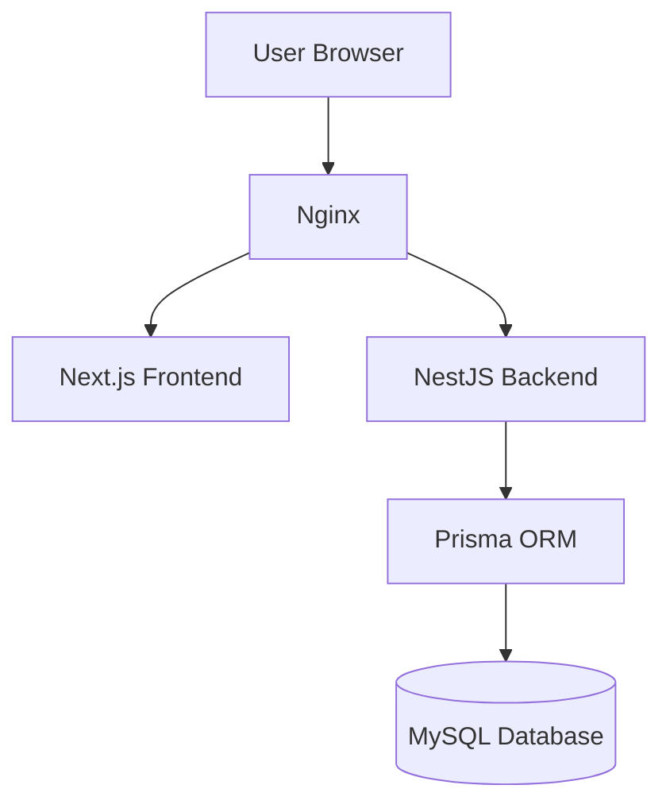
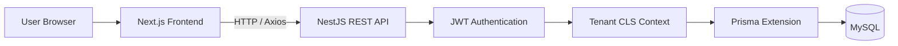
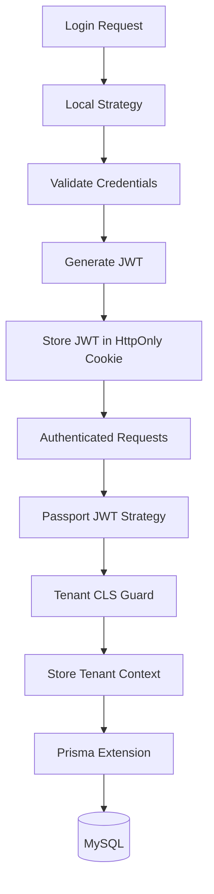
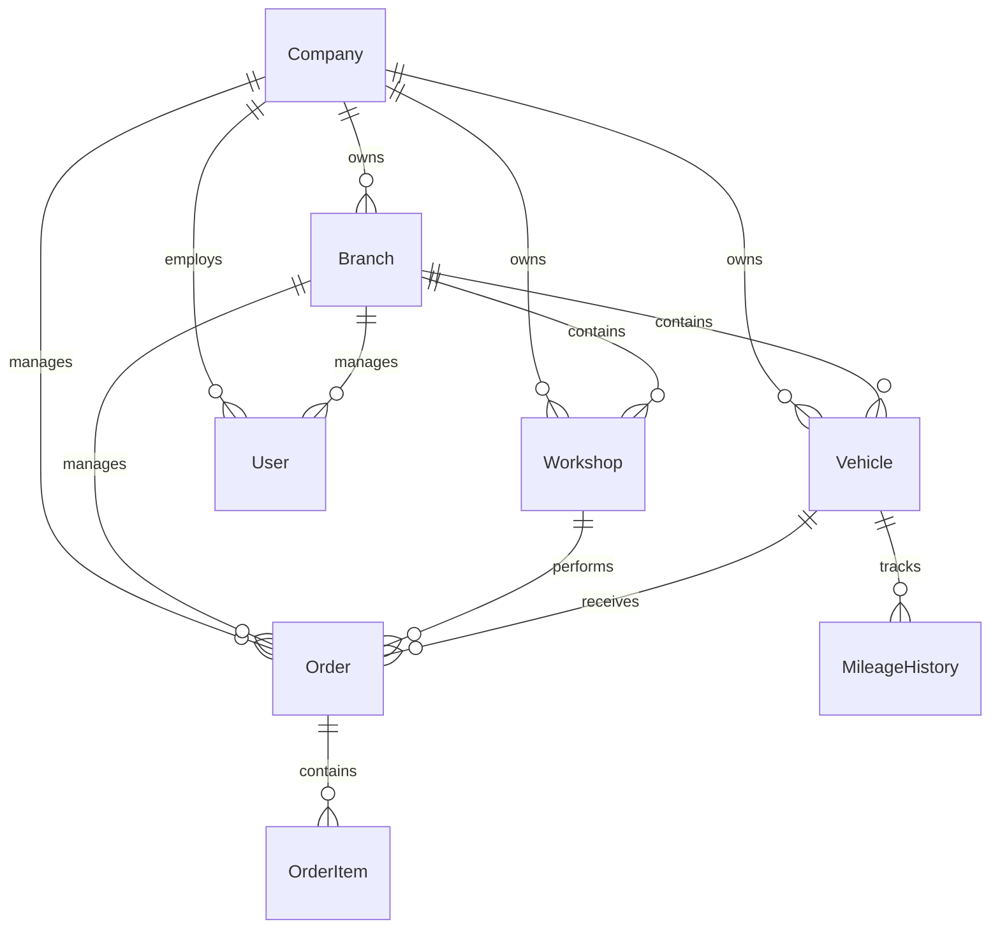

# 🚛 FleetSync

<div align="center">

# FleetSync

**A Multi-Tenant Fleet Management SaaS Platform**

Manage vehicles, maintenance operations, workshops, branches and teams through a secure, scalable and role-based platform.

<p>


</p>

</div>

---

## 📖 Overview

FleetSync is a full-stack fleet management platform designed for companies that need to manage their entire vehicle operation through a centralized web application.

The platform provides complete control over vehicles, maintenance orders, workshops, branches and team members while ensuring strict data isolation between organizations through a multi-tenant architecture.

Unlike traditional CRUD applications where tenant filtering is manually implemented across services, FleetSync centralizes access control using **Prisma Extensions** and **Continuation Local Storage (CLS)**. This approach automatically scopes database queries to the authenticated user's company, reducing duplicated logic and minimizing the risk of cross-tenant data exposure.

The project was developed using modern technologies such as **Next.js**, **NestJS**, **Prisma ORM**, **MySQL** and **Docker**, following a modular architecture focused on scalability, maintainability and clean code principles.

---

## 🏗 High-Level Architecture



---

# ✨ Highlights

- Multi-tenant SaaS architecture
- Automatic tenant isolation using Prisma Extensions
- Role-Based Access Control (RBAC)
- JWT authentication with HttpOnly Cookies
- Modular NestJS backend
- Next.js App Router frontend
- Prisma ORM with MySQL
- Docker-based development environment
- Responsive dashboard
- Advanced data tables
- Interactive reports and analytics
- Fully written in TypeScript

---

# 🚀 Features

## Fleet Management

- Vehicle registration and management
- Driver assignment
- Vehicle status tracking
- Mileage history
- Insurance management
- Licensing management
- IPVA management

---

## Maintenance Management

- Preventive maintenance
- Corrective maintenance
- Periodic maintenance
- Maintenance history
- Cost tracking
- Order management
- Order items

---

## Organization Management

- Company management
- Branch management
- Workshop management
- Team management
- User management

---

## Dashboard

FleetSync provides dedicated modules for monitoring the fleet operation.

Current dashboards include:

- Dashboard Overview
- Fleet Management
- Maintenance Orders
- Workshops
- Branches
- Team
- Reports

---

## Security

- JWT Authentication
- HttpOnly Cookies
- Password hashing with bcrypt
- Passport Local Strategy
- Passport JWT Strategy
- Role-Based Access Control
- Automatic tenant filtering
- Protected API routes

---

# 📸 Screenshots

> **Screenshots will be added soon**

Suggested screenshots:

- Login
- Dashboard
- Fleet
- Orders
- Workshops
- Branches
- Team
- Reports

---

# 🏗 System Architecture

FleetSync follows a modern client-server architecture composed of three main layers:

- **Frontend**: Next.js application responsible for the user interface.
- **Backend**: NestJS REST API containing the business logic.
- **Database**: MySQL accessed through Prisma ORM.



This architecture promotes clear separation of responsibilities while keeping the application scalable and maintainable.

---

# 🔐 Authentication Flow

Authentication is implemented using **JWT stored in HttpOnly cookies**, preventing direct access to tokens from client-side JavaScript.

The authentication pipeline is composed of:

- Passport Local Strategy
- JWT generation
- HttpOnly Cookies
- Passport JWT Strategy
- Tenant Context initialization
- Automatic Prisma filtering



This approach provides secure authentication while keeping session management completely stateless.

---

# 🏢 Multi-Tenant Architecture

FleetSync was designed using a **shared database / shared schema** multi-tenant architecture.

Instead of maintaining a dedicated database for each company, all tenants share the same database while data isolation is enforced automatically.

Each authenticated request carries the following tenant information:

- Company ID
- Branch ID
- Workshop ID
- User Role

These values are stored using **Continuation Local Storage (CLS)**.

The Prisma Extension reads this context before every supported query and automatically injects the appropriate filters.

For example, instead of writing:

```ts
await prisma.vehicle.findMany({
  where: {
    companyId: user.companyId,
    branchId: user.branchId,
  },
});
```

Developers simply write:

```ts
await prisma.vehicle.findMany();
```

The Prisma Extension transparently transforms the query by applying the authenticated tenant filters.

### Benefits

- Eliminates duplicated filtering logic
- Centralizes tenant isolation
- Prevents accidental data leakage
- Keeps services clean and maintainable
- Reduces human error
- Simplifies feature development

---

# 👥 Role-Based Access Control

FleetSync implements **Role-Based Access Control (RBAC)**.

Every authenticated user receives a role that defines the scope of accessible resources.

Current roles include:

| Role | Description |
|------|-------------|
| **ADMIN** | Full access to company resources |
| **BRANCH_MANAGER** | Access restricted to branch resources |
| **WORKSHOP_MANAGER** | Access restricted to workshop operations |
| **DRIVER** | Access to assigned vehicle information |

Authorization is enforced by combining:

- JWT Authentication
- Tenant Context
- Prisma automatic filtering

This guarantees that users only access data they are authorized to view.

---

# 🗄 Database Model

FleetSync uses a relational database modeled with **Prisma ORM**.

The domain is centered around companies, branches, workshops, vehicles and maintenance orders.



### Main Entities

- Company
- Branch
- Vehicle
- Workshop
- User
- Order
- Order Item
- Mileage History

The database was designed to support real-world fleet operations while maintaining referential integrity and efficient relationships between business entities.

---

# 🎨 Frontend Architecture

The frontend was built with **Next.js 14** using the **App Router** architecture, focusing on modularity, maintainability and responsive user experience.

The application is organized around business domains, making each module independent and easy to evolve.

### Main Modules

- Authentication
- Dashboard
- Fleet
- Maintenance Orders
- Workshops
- Branches
- Team
- Reports
- User Profile

### Frontend Highlights

- Next.js 14 App Router
- React Server Components
- TypeScript
- Responsive interface
- Accessible UI components
- Advanced data tables
- Interactive dashboards
- Client-side data caching
- Schema-based form validation

---

# ⚙ Backend Architecture

The backend follows **NestJS's modular architecture**, separating each business domain into independent feature modules.

Each module encapsulates its own controllers, services, DTOs and business rules, improving scalability and maintainability.

### Main Modules

- Authentication
- Companies
- Branches
- Vehicles
- Workshops
- Orders
- Users
- Dashboard
- Prisma
- Prisma Tenancy

### Architectural Principles

- Modular design
- Dependency Injection
- Separation of Concerns
- DTO Validation
- Repository abstraction through Prisma
- Automatic tenant isolation
- Stateless authentication

---

# 🛠 Technology Stack

## Frontend

| Technology | Purpose |
|------------|---------|
| Next.js 14 | React Framework |
| React 18 | User Interface |
| TypeScript | Static Typing |
| Tailwind CSS | Styling |
| Radix UI | Accessible UI Components |
| TanStack Table | Data Tables |
| React Hook Form | Forms |
| Zod | Validation |
| Axios | HTTP Client |
| SWR | Data Fetching |
| Recharts | Charts |
| Lucide | Icons |
| date-fns | Date Utilities |

---

## Backend

| Technology | Purpose |
|------------|---------|
| NestJS | Backend Framework |
| Prisma ORM | Database Access |
| MySQL | Relational Database |
| Passport | Authentication |
| JWT | Authorization |
| Swagger | API Documentation |
| bcrypt | Password Hashing |
| class-validator | DTO Validation |
| class-transformer | Data Transformation |
| nestjs-cls | Tenant Context |
| Faker | Database Seed |
| Jest | Testing |

---

## Infrastructure

| Technology | Purpose |
|------------|---------|
| Docker | Containerization |
| Docker Compose | Development Environment |
| Nginx | Reverse Proxy |

---

# 📁 Project Structure

```text
.
├── backend/                     # NestJS REST API
│   ├── prisma/                  # Prisma schema and seed
│   ├── src/
│   │   ├── modules/             # Business modules
│   │   ├── prisma/              # Prisma service
│   │   ├── prisma-tenancy/      # Multi-tenant extension
│   │   └── main.ts
│   └── Dockerfile
│
├── frontend/                    # Next.js application
│   ├── app/                     # App Router
│   ├── components/
│   ├── lib/
│   ├── public/
│   └── Dockerfile
│
├── nginx/                       # Reverse Proxy
│   ├── nginx.conf
│   └── Dockerfile
│
├── docker-compose.dev.yml
├── docker-compose.prod.yml
├── request.http
└── README.md
```

The project is organized into independent services, allowing each layer to evolve separately while keeping a clear separation between frontend, backend and infrastructure.

---

# 💡 Technical Decisions

FleetSync was designed with a strong focus on architecture rather than simply implementing application features.

### Multi-Tenant Data Isolation

Tenant filtering is handled transparently through a custom Prisma Extension combined with **Continuation Local Storage (CLS)**.

Business services never need to manually filter data by company, branch or workshop, since tenant constraints are automatically injected into supported database queries.

---

### Stateless Authentication

Authentication is implemented using **JWT stored in HttpOnly cookies**.

This approach keeps the API stateless while protecting authentication tokens from client-side JavaScript access.

---

### Modular Backend

The backend follows NestJS's modular architecture, where each business domain is isolated into dedicated modules containing controllers, services and DTOs.

This structure improves maintainability and simplifies future feature development.

---

### Relational Database Modeling

The database was modeled using Prisma ORM with normalized relationships between companies, branches, workshops, vehicles, users and maintenance orders.

The model supports real-world fleet management scenarios while preserving data integrity and consistency.

---

### Docker-Based Development

The entire development environment runs inside Docker containers.

A single Docker Compose command starts every required service, ensuring a consistent development experience across different machines.

---

# 🚀 Getting Started

FleetSync was designed to provide a simple and consistent development experience using Docker.

Once the required environment variables are configured, the entire application can be started with a single command.

## Prerequisites

Before running the project, make sure you have installed:

- Docker
- Docker Compose

---

## Clone the repository

```bash
git clone https://github.com/FelipeTavares/fleetsync.git

cd fleetsync
```

---

## Configure Environment Variables

Create the required `.env` files inside the **backend** and **frontend** directories.

Example:

### Backend

```env
DATABASE_URL=
JWT_SECRET=
```

### Frontend

```env
NEXT_PUBLIC_API_URL=
```

---

## Start the Application

Run:

```bash
docker compose -f docker-compose.dev.yml up --build
```

The development environment will automatically:

- Build all containers
- Start the MySQL database
- Generate the Prisma Client
- Apply database migrations
- Populate the database with sample data
- Start the NestJS API
- Start the Next.js application
- Configure Nginx

After the initialization process, FleetSync will be ready to use.

---

# 🐳 Docker Services

The development environment is composed of the following services:

| Service | Description |
|----------|-------------|
| MySQL | Relational database |
| Backend | NestJS REST API |
| Frontend | Next.js application |
| Nginx | Reverse proxy |

---

# 🌱 Sample Data

The development environment automatically populates the database with realistic sample data during the first startup.

The generated data includes:

- Companies
- Branches
- Workshops
- Users
- Drivers
- Vehicles
- Maintenance Orders
- Order Items
- Mileage History

This allows the application to be explored immediately after installation without requiring manual setup.

---

# 🤝 Contributing

Contributions, suggestions and improvements are welcome.

If you'd like to contribute:

1. Fork the repository
2. Create a feature branch
3. Commit your changes
4. Open a Pull Request

---

# 📄 License

This project is licensed under the MIT License.

See the LICENSE file for more information.

---

# 👨‍💻 Author

**Felipe Tavares**

Full Stack Developer

GitHub

> https://github.com/FelipeTavares

LinkedIn

> *(Add your LinkedIn profile)*

Portfolio

> *(Add your portfolio when available)*

---

<div align="center">

## FleetSync

**A modern multi-tenant fleet management platform built with Next.js, NestJS, Prisma and Docker.**

Designed to demonstrate scalable backend architecture, secure authentication, automatic tenant isolation and modern full-stack development practices.

⭐ If you found this project interesting, consider giving it a star.

</div>
